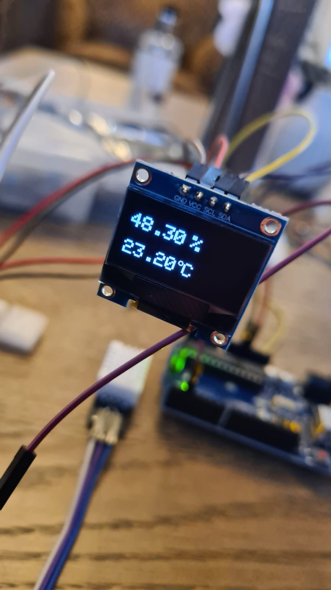

This project is a joint effort to bring weather analysis to the indoor space of our homes.

## Pin configuration
### DHT22
Out pin -> Pin 2 Arduino

### Screen module
SCL -> Pin A5 Arduino
SDA -> Pin A4 Arduino

## End result

ALL RIGHTS PRESERVED HAMBURG-BUCHAREST 2024 - TILL END OF TIMES
